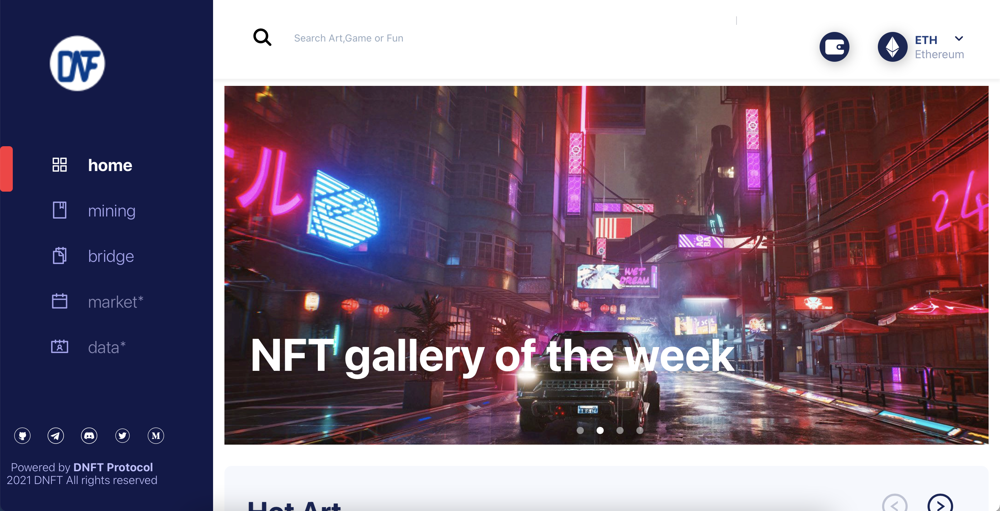
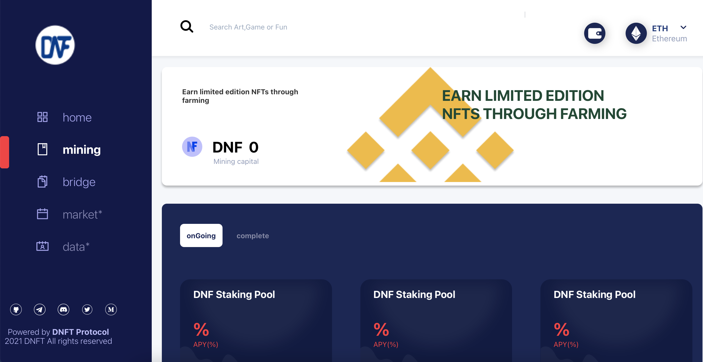
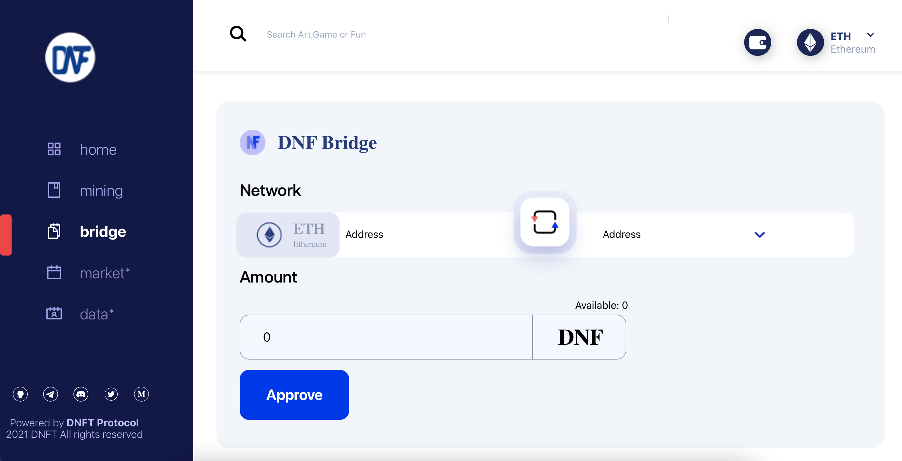
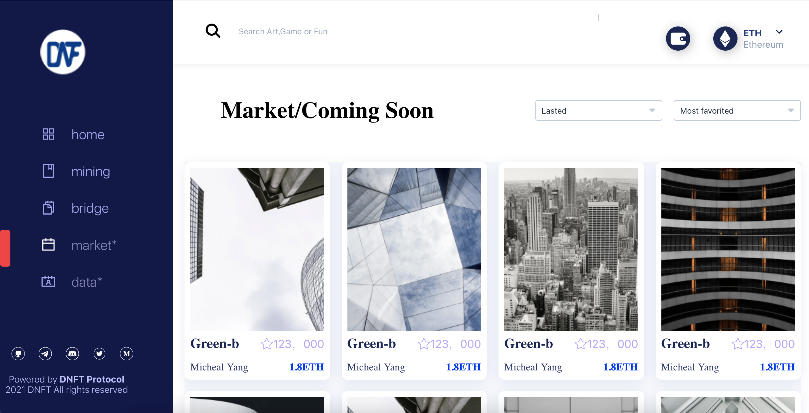
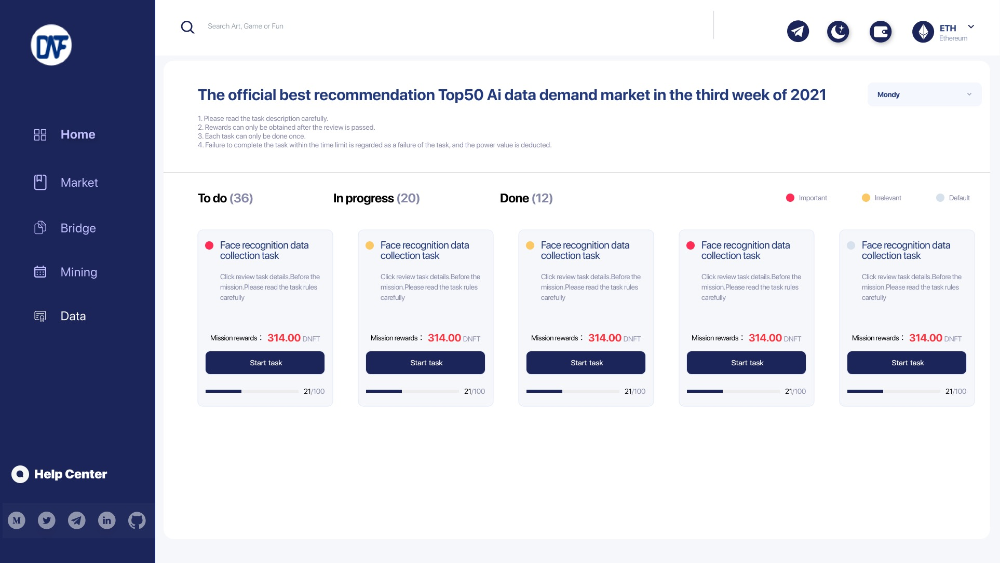

# DNFT项目介绍文档

## 介绍

# 协议概述

## DNFT是什么

DNFT是基于Substrate的跨链去中心化NFT资产网络，致力于构建新一代NFT协议，特别是面向大数据和实用型NFT资产; 我们融合了NFT资产创建，NFT去中心化交易/竞拍，NFT维护税费，NFT回收机制，以及DNFT治理等功能;DNFT治理通过链上治理、预言机、存储机制管理、回收机制管理、系统协议 管理开发来维护DNFT DAO机制。

 

我们的目标是发展成NFT领域的跨链基础设施。DNFT协议是第九批Web3.0基金会官方赞助项目，也获得BSC官方赞助，同时在多次黑客松比赛里斩获奖项。团队主体来自澳大利亚，目前已获得多家机构如了得资本、Candaq、水滴资本等数十家机构投资。

 

## DNFT的生态架构

DNFT系统由**数据存储、数据带税、数据交换、DAO治理和人工智能工具包**五个重要部分组成。由整个系统运作**数据的生成、存储、交换、共享、传播**。通过数据ETL和数据标签注释，DNFT正在一个基于个人数据和人工智能模型之间的数据框架。

 

DNFT协议集成了**NFT****资产创建、NFT资产分散交易/拍卖、NFT资产维护税、NFT恢复机制和DNFT治理**等功能。同时，通过整合Polkadot跨链资产协议（XCMP），NFT和资产被跨链转移。

 

DNFT协议的算法稳定token模块通过质押点（Polkadot生态token）获得dUSD（DNFT协议生态稳定token）。dUSD和DNF（DNFT协议生态token）将被用作NFT、游戏和其他DNFT协议生态应用的入口token。

 

DNFT协议的算法治理模块以**DNFT DAO****治理的**方式来管理DNFT协议的生态应用。

 

DNFT协议鼓励NFT和游戏项目加入**DNFT****协议生态系统**。当主网络正式启动后，NFT和游戏项目的拨款奖励计划将上线，以资助和开发NFT和游戏项目，丰富DNFT协议生态系统。

## DNFT的治理协议

NFT协议的最终目标是DNFT治理。首先，项目组选择NFT协议参数和恢复治理对象，如收益率、支付周期变更等。在未来，这些系统将通过社区管理模式进行迭代升级。社区治理需要通过DNFT理事会（持有DNFT协议token-DNF）进行。

 

DNFT理事会监管整个过程，只有DNFT理事会有权决定NFT协议治理、NFT&Game奖、生态治理等功能。在TNFT版本测试网络的初始测试和实现后，KNFT将在线发布并添加到Kusama生态系统中。KNFT运行一段时间后，将启动KNFT主网络。DNFT议定书协议的制定受DNFT理事会的约束，任何改进都将由DNFT理事会投票决定。

 

 

 

## 安全性

审计与正式验证

1 月 8 日至 4 月 30 日期间，一个由 6 名工程师组成的团队审查并正式验证了 DNFT 智能合同的关键组件。工作包括智能合约的开发和多抵押 DAI 的正式验证。

工作范围包括：

正式验证核心智能合约

核心智能合约的代码审查

数值误差分析

外围智能合约的代码审查（正在开发中）

该报告也有一个“设计意见”部分，我们强烈建议获得一个深入的技术理解一些人的选择在 DNFT 。

 

在DNFT 上构建时需要考虑的问题

当将DNFT 集成到另一个链上系统时，必须特别注意避免安全漏洞、操作途径和潜在的资金损失。

作为一个初步说明：智能合约集成可以在两个级别进行：直接使用一对合同，或通过路由器.直接的互动提供了最大的灵活性，但需要最大的工作来获得正确。介导的相互作用提供了更有限的能力，但更强的安全保障。

有两个主要类别的风险与DNFT 。首先涉及所谓的“静态”错误。这些可能包括在交换期间发送过多的令牌（或请求太少的令牌），或允许交易在内存池中逗留足够长的时间，使发送者对价格的预期不再准确。

可以通过相当简单的逻辑检查来解决这些错误。执行这些逻辑检查是路由器的主要目的。直接与 pair 交互的人必须自己执行这些检查（在图书馆).

第二类是“动态”风险，涉及运行时定价。因为以太坊交易发生在一个对抗性的环境中，天真地编写的智能合约可以而且将会被用于盈利。例如，假设一个智能合约在运行时检查DNFT池中的资产比率并与之进行交易，假设该比率代表这些资产的“公平”或“市场”价格。在这种情况下，它非常容易受到操纵。一个恶意的行为者可以，例如，琐碎地插入交易之前和之后的天真的交易（所谓的“三明治”攻击），导致智能合约交易在一个非常糟糕的价格，从交易商的费用从中获利，然后返回合同到他们的原始状态，所有在低成本。（一个重要的警告是，这些类型的攻击可以通过在高流动性池中交易或在低价值交易来缓解。）

防范这些攻击的最佳方法是引入价格预言器。甲骨文是任何设备，返回所需的信息，在这种情况下，一对的现货价格。最好的“神谕”只是交易者对当前价格的链外观察，可以作为安全检查传递到交易中。这种策略最适合零售交易场所，用户以自己的名义发起交易。然而，通常情况下，一个可信的价格观察是不可用的（例如，在多步骤，涉及DNFT 的程序化交互）。如果没有价格神谕，这些互动将被迫以任何（潜在操纵）利率在 DNFT 交易。

 

## 交易

该 SDK无法代表您执行交易或发送交易.相反，它提供了实用工具类和函数，使得计算安全地与DNFT交互所需的数据变得很容易。几乎所有您需要的安全处理与 DNFT 是由贸易实体但是，您有责任使用这些数据在任何对您的应用程序有意义的上下文中发送事务。

本指南将专门侧重于将事务发送到目前推荐的DNFT.

那么，我们已经构建了一个交易实体，但是我们如何使用它来发送交易呢？我们还有几件事要做。

 

在继续之前，我们应该探讨 ETH 如何在交易环境中工作。际上，该SDK使用 WETH ，因为所有的 DNFT V2 副都在引擎盖下使用 WE TH 。然而，作为终端用户，您完全有可能使用 ETH ，并依靠路由器来处理与 WETH 的转换。所以，还是用 ETH 吧。

第一步是选择合适的路由器功能。路由器函数的名称是不言自明的；在本例中，我们希望交换执行令牌，因为我们要用一定数量的 ETH 来换代币。

滑动公差编码在我们的交易失败之前，我们愿意容忍多大的价格波动.由于以太坊交易是在对抗性的环境中广播和确认的，这种容忍是我们能做的最好的保护自己免受价格波动的影响。我们使用这个滑动公差来计算米努姆在我们的贸易恢复之前，我们必须收到的 DAI 数量，感谢出最小山.注意，此代码计算最坏情况的结果假设现在的价格，也就是航线的中间价是公平的（通常是一个很好的假设，因为套利）。

路径只是我们正在交易的令牌地址的有序列表，在我们的例子中，Weth和DAI(请注意，我们使用Weth地址，尽管我们使用ETH)。收件人地址是将接收 DAI 的地址。

最后期限是 Unix 时间戳，在此之后，交易将失败，以保护我们的情况下，我们的交易需要很长时间来确认，我们希望取消我们的贸易。该值是必须作为msg.value在我们的交易中。

 

# 开发人员指南

## 接口集成

## 使用API

在本指南中，我们将创建一个网页界面，该界面消耗和显示来自DNFT子图的数据。目标是提供一个快速的设置概述，您可以扩展该设置，以围绕DNFT数据创建自己的用户界面和分析。

许多不同的库可用于创建接口和与子图graph graphql 端点的连接，但在本指南中，我们将使用 React 进行接口，使用 Apollo Client 发送查询。我们还将使用纱线进行依赖管理。

设置和安装

我们需要为应用程序创建基本骨架。我们将为此使用create-react-app。我们还将添加我们需要的依赖项。导航到命令行中的根位置，然后运行：

 

在浏览器中，您应该看到默认的React应用程序正在运行。在文本编辑器中，在src中打开App.js，并用这个剥落的样板替换内容。我们边走边加。

 

Graphql客户端

我们需要设置一些中间件，以便向DNFT子图提出请求并接收数据。为此，我们将使用阿波罗并创建一个Graphql客户端来处理这个问题。

添加下图所示的导入并实例化新的客户端实例。请注意我们如何使用此处的DNFT子图的链接。

 

我们还需要添加一个上下文，以便阿波罗能够正确处理请求。在index.js文件中导入适当的提供程序，并像这样包装根目录：

 

编写查询

接下来我们将构建我们的查询和获取数据。对于此示例，我们将在DNFT上获取一些关于Dai令牌的数据。我们将获得当前价格和所有对的总流动性。在此查询中，我们将使用 ?? 代地址作为ID。我们还将获取ETH的美元价格，以帮助为Dai数据创建美元转换。

首先我们需要定义查询本身。我们将使用gql将查询字符串解析为GraphQL AST标准。将gql助手导入应用程序，并使用它创建查询。将以下内容添加到您的App.js文件中：

 

 

# 前端集成

## SDK

以下网页载有关于DNFT 的技术参考资料SDK. 寻找一快速启动反而呢？ 你可能还想跳进一个向导, 它提供了一个更友好的介绍SDK!

SDK 是用 TypeScript 编写的，有一个健壮的测试套件，执行任意精度的算法， 并且支持舍入到有效位数或固定小数位。 主要出口的SDK是实体：包含初始化和验证检查的类 必要的数据字段和帮助函数。

中的一个重要概念SDK是分数.因为 Solidity 执行整数数学，所以必须注意 非 EVM 环境，以忠实地复制在链上进行的实际计算。 这里的第一个问题是确保使用安全溢出的整数实现。 理想情况下，该SDK能够使用本机大印斯 然而，在支持变得更加广泛之前，履行机构对象被使用， 有了一旦BigInts激增的想法，这种依赖就可以被编译掉。 第二个问题是精度损失，例如，链式价格比率计算。 为了解决这个问题，所有的数学操作都以分数运算的形式执行，确保任意精度向上。 直到值为显示目的而四舍五入，或截断以适合固定位宽的点为止。SDK 适用于所有链上的工厂已部署。

代码

 

这源代码可以在 GitHub 上找到.

依赖关系

SDK 将其依赖声明为对等依赖. 这有两个原因：

防止安装未使用的依赖项（如：@ethersproject/providers和@ethersproject/contracts，只用于Fetcher)

防止重复@ethersproject版本冲突的依赖关系

但是，这意味着必须将这些依赖项安装在SDK,如果您还没有安装它们。

 

## 智能合约

DNFT 是一个二进制智能合约系统。核心合同为与DNFT 互动的各方提供了基本的安全保障。边缘契约与一个或多个核心契约相互作用，但它们本身不是核心的一部分。

核心源代码

核心由一个单例工厂而许多对，工厂负责创建和索引。这些合同都是非常小的，甚至是残忍的。这样做的基本原理是，使用较小的表面积的合同更容易推理，更不容易出现 bug ，而且功能上更优雅。也许这种设计最大的好处是，系统的许多期望的属性可以直接在代码中断言，几乎没有留下错误的空间。然而，一个缺点是核心合同对用户有些不友好。事实上，对于大多数用例，不建议直接与这些契约交互。相反，应该使用外围合约。

工厂参考文件

工厂持有的通用字节码负责供电对。它的主要工作是为每个唯一的令牌对创建一个且只有一个智能合约。它还包含打开协议充电的逻辑。

参考文件

参考文件(第二十次专家审评会议)

对有两个主要目的：作为自动做市商和跟踪池令牌余额。它们还公开可用于构建分散价格神谕的数据。

边缘源代码

外围是一组智能合约，旨在支持特定领域与核心的交互。由于DNFT的无许可性质，下文所述的合同没有特权，事实上只是可能的外围类合同的一小部分。然而，他们是如何安全和有效地与DNFT 交互的有用示例。

 

图书馆参考文件

该库提供了各种方便的功能，用于获取数据和定价。

 

路由器参考文件

使用该库的路由器完全支持前端提供交易和流动性管理功能的所有基本要求。值得注意的是，它本机支持多对交易（例如 x 到 y 到 z ），将 ETH 视为一等公民，并提供元交易来消除流动性。

 

设计决策

下面的章节描述了一些在DNFT中做出的值得注意的设计决策。除非您有兴趣深入了解DNFT的工作原理，或者编写智能合约集成，否则可以跳过这些步骤！

 

发送令牌

通常，需要令牌来执行某些功能的智能合约要求潜在的交互者首先对令牌合约进行批准，然后调用一个函数，该函数反过来调用令牌合约上的 transfer From 。这是不V2 对如何接受令牌。相反，对在结束然后，在每一个交互的开始下一个交互时，当前余额与存储的值相异，以确定当前交互者发送的令牌数量。看到了白皮书为了解释为什么会这样，但结论是在调用任何需要令牌的方法之前，令牌必须被转移到该对（这条规则的一个例外是闪速掉期).

 

韦思与DNFT池不同， V2 对不直接支持 ETH ，因此 ETH ERC - 20 对必须与 WETH 一起模拟。这种选择背后的动机是删除核心中特定于 ETH 的代码，从而实现更精简的代码库。但是，通过在外围简单地包装/展开 ETH ，最终用户可以完全不知道这个实现细节。

路由器完全支持通过 ETH 与任何 WETH 对交互。

 

最低流动性

为了改善四舍五入误差和增加流动性提供的理论最小报价大小，对燃烧第一最小流动性泳池代币。对于绝大多数对，这将表示一个微不足道的值。燃烧在第一次流动性供应期间自动发生，在此之后总供给是永远更多的边界。

 

# 我们的产品

## Home

搜索查询

资产管理中心

链接钱包

信息展示

资产收藏与交易

 

 

 

## Mining

挖矿

资产质押

 

## Bridge

跨链

 

 

## Market

艺术品管理中心

艺术品收藏

艺术品购买

 

## Data

活动信息中心

智慧数据

 

# 资源地址

## DNFT网站

https://www.dnft.world

 

## 白皮书

 

## GitHub

https://github.com/DNFT-Team 

 

## 推特

https://twitter.com/dnftprotocol

 

## Medium

https://medium.com/dnft-protocol

 

 

 

 
